# Lambda-Calculus. Beta-reduction
Oganyan Robert course work.

Simple interpreter for beta-reduction of terms. Implemented with C++14.

## Work demonstration

Start screen.

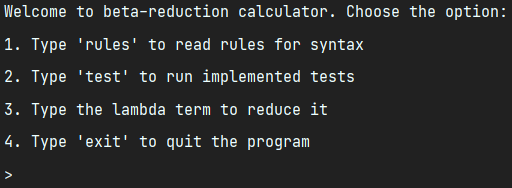

Rules list.

 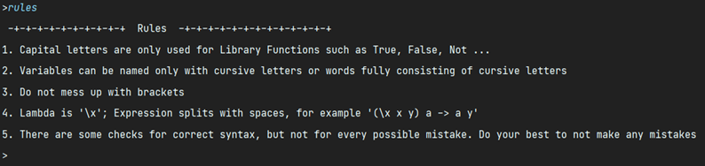

Starting own-written tests.

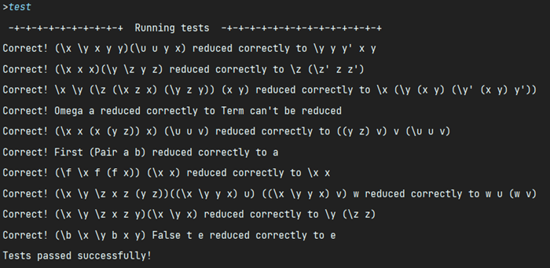

Lets reduce this term: 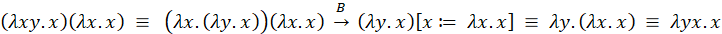 . 

*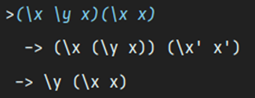*

That is correct.

 

Now lets try this one: 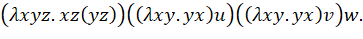 The result should be 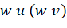.

*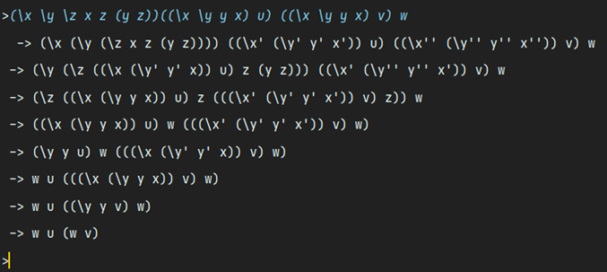*

Correct. Now lets calculate (0 + 2 * 1) = 2

 

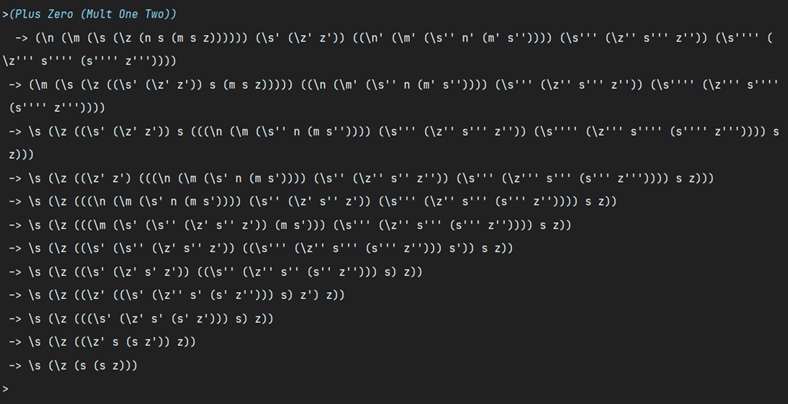

We are having 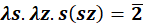**.** Reduction has been done correct.

Quit the program.

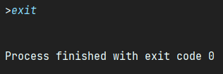

