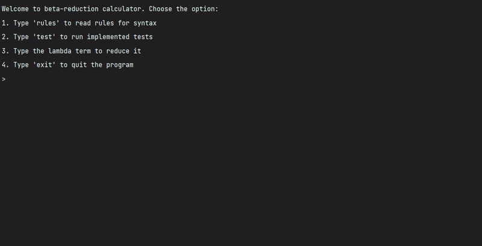

# Lambda-Calculus. Beta-reduction of lambda terms with de Braun indices
**This repository is outdated. The actual project is [here](https://github.com/OganyanRV/Lambda-calculus-interpreter). The problem with this version is that I do not use an abstract syntax tree to find redexes, I look for them in a string, which works, but it is ideologically wrong.**

Course work of [Oganyan Robert](https://t.me/robasti). Third year of study, 6th term.

Here is a simple **interpreter** for *beta-reduction* of terms. **Beta reduction** of lambda terms has been implemented using **de Bruijn (de Braun) notation** and related: **alpha conversions**, **naming contexts**, **shifts** and **substitutions**.

Implemented with C++14, JetBrains Clion.

## Work demonstration

### Gif

### Screenies

Start screen.

Rule's list.

 

Starting own-written tests.

Lets reduce this term:  . 

**

That is correct.

 

Now lets try this one:  The result should be .

**

Correct. Now lets calculate (0 + 2 * 1) = 2

 

We are having **.** Reduction has been done correct.

Quit the program.

